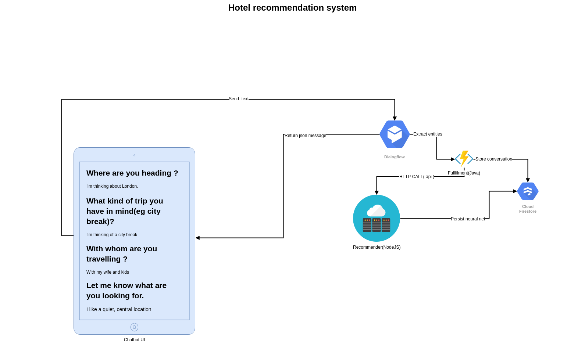
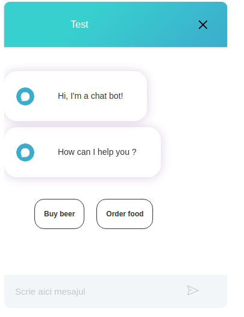

# Katea Chatbot

- [Katea Chatbot](#katea-chatbot)
  - [Project mission](#project-mission)
  - [What problem does it solve ?](#what-problem-does-it-solve-)
  - [How we're solving the problem: personalizing recommendations with a human touch](#how-were-solving-the-problem-personalizing-recommendations-with-a-human-touch)
    - [Conversation structure](#conversation-structure)
    - [High level architecture](#high-level-architecture)
    - [Modules](#modules)
    - [UI](#ui)
    - [Fullfillment service](#fullfillment-service)
    - [Recommender service](#recommender-service)
    - [Entities](#entities)
    - [Training the entity extraction](#training-the-entity-extraction)
    - [Training the recommendations AI](#training-the-recommendations-ai)
    - [Code structure](#code-structure)
    - [Chatbot UI](#chatbot-ui)
    - [Installing and launching the UI](#installing-and-launching-the-ui)
    - [Recommendation Engine](#recommendation-engine)
    - [Important files and their roles](#important-files-and-their-roles)
    - [How to run the recommendation engine ?](#how-to-run-the-recommendation-engine-)
    - [Scraper](#scraper)
    - [katea-server](#katea-server)

## Project mission

Enable better, more custom tailored and meaningfull hotel recommendations to delight customers by discovering places and experiences that resonate with the user.

### What problem does it solve ?

Most of the hotel recommendations are done throught written reviews and word of mouth. However, this means that finding the perfect place for the next hangout with friends or romantic get-away requires a lot of manual research, by digging throught reviews and identifying the pros and cons of each.

Instead, companies providing services in the tourism industry could benefit a lot by providing to their customer "human" like guidance in order to quickly surface the best accomodations that match what their customers are looking for.

This process of match-making a customer to accomodations is a lot more than a simple website search for location/price/review score. For it to provide truly meaningfull suggestions it needs to take into account the type of trip being made, with whom, where and are the kind of things the customer values most when looking for a hotel.

### How we're solving the problem: personalizing recommendations with a human touch

The key for most bussines for being succesfull is **personalization** . Designing the product experience and making suggestions not for _a customer_ but for _the customer_.

We're bringing a human touch to accomodation matching process by building a chatbot UI that ask the user a few well calibrated questions and is ready to ingest and make sense of what the user is saying without resorting to clunky, inflexible forms/selection UIs.

These discovered semantics are then fed into a "Recommendation system" employing AI to
make the best suggestions that take into account criterias, fine lines expressed by the user.

The recommendation system is continously learning, developing a deeper understanding of what things mean and how to better match the suggested accomodations to what the user is asking.

It does this by asking the users to rate the recommendations that were received, improving each and every time and being more in line with what the user is looking for.

Given enought time and interaction experiences with humans the system can learn to make really good recommendations and it only gets better at it.

### Conversation structure

The conversation that the bot is trained to perform is centered around getting the following pieces of information:

1. The location where the user is going
2. The type of trip it is looking to undertake - There is a big difference after all between a romantic getaway, a work related travel or a city break with friends.
3. With whom the user is travelling - Because travelling with kids and travelling alone are totally different thing
4. What are the most valuable features/attributes for the user.

The last part of the conversation is about offering suggestions and getting back feedback
from the user.

The chatbot will make additional suggestions as long as the user wants to.

Here is a high level overview of the conversation flow:

### High level architecture

The system is comprised of 4 modules and it's built on the following stack:

- Svelte compiler (FE)
- DialogFlow (NLP)
- Java (BE - fullfilment service)
- NodeJS (BE - recommender system)
- NoSQL D
- TensorFlow - for implementing the logistic regression in Recommender Engine.
- ExpressJS - For the Recommender Engine HTTP interface

#### Modules

The modules of the system are:

- Chatbot UI - a custom built UI for the Chatbot enabling text dispay, typing indicators and display of image carousels.
- DialogFlow agent - a NLP enabled chat layer, responsible for figuring out what the user is saying, what are the entities being present in the text
- Fullfilment service - Responsable for deciding how to respond to user queries and running the initial training phase for the Recommender system.
- Recommender system - a system backed by AI capable of taking as input the entities detected by the NLP layer and making suggestions for hotels based on them. the Recommender system also employs re-inforcement learning by constantly asking for
  human feedback on the recommandations that it does.
- Database - a NoSQL database holding the knownledge base of hotels, conversation history
  and recommendations done.

#### UI

The UI is responsable for providing 2 types of message integrations with DialogFlow:

- text message - Displays a text message sent from the BE
- carousel message - Displays a carousel of images with clickable links and buttons.

Is build on Svelte because of:

- extremely small footprint - it's actually a compiler instead of a framework and it can be deployed and integrated into bussines websites without adding a big overhead
- extremely fast - One of the fastest frameworks out there.
- reactive - everything is reactive and it just updates = fewer bugs

#### Fullfillment service

The fullfilment service is responsable for taking the NLP parsed entities and:

- storing the conversion
- figuring out how to respond to the incoming data, eg by querying the Recommender system
- maintain chat session context state

It's implemented in Java.

#### Recommender service

It operates in 2 modes:

1. Suggestions - Takes parsed NLP entities as input and tries to match them to hotels
2. Learning - Gets user feedback on suggestion and makes adjustments to it's algorithm for improved recommendations

The ideas behind the Recommender service is to perform a multi-nomial logistic regression based where:

1. **INPUTS** - Desirable features that an user is looking for at an accomodation. Eg good wifi, great breakfast etc. These are quantified numerically with a number between 0-1.

2. **OUTPUTS** - A vector containing the marginal probability distribution for all of the hotels in the selected location. From them we select top N that we haven't yet presented to the user and we make a suggestion.

Basically each hotel in a certain location becomes a class(label) in the classification
problem.

The **INPUTS** for the classifier are generated in 2 phases:

1. Fullfilment service - parses the user text and by employing NLP techniques it extracts the entities in the text.
2. The entities are handed-of to the "Recommender service" which encodes each of them in the 0-1 value space and uses them to generate some suggestions.

By tweaking the values for the features by on the NLP analisys it is possible to express subtle meanings that are otherwise impossible to express during traditional, form based, search. Eg: "the most important things is to have a pool, i care about it being quiet and i don't care too much about the location".

It's written in NodeJS.

#### Entities

The system is trained to recognize the following entities:

1. city - eg London, Dubai etc
2. travel_type_work - All the possible ways of expressing that the user is travelling for work
3. travel_type_honeymoon - All the possible ways of expressing that the user is travelling for honeymoon
4. travel_type_citybreak - All the possible ways of expressing that the user is travelling for a short period of time, in a city, mostly for visiting purposes
5. travel_type_holiday - User is travelling for an extended period of time for relaxing purposes
6. travel_companion_solo - User is travelling single
7. travel_companion_kids - User is travelling with kids
8. travel_companion_couple - User is travelling with the significant other
9. travel_companion_friends - User is travelling with group of friends
10. accomodation_quality_cleanliness - All the possible ways of saying the room is/must be clean.
11. accomodation_quality_breakfast - The hotel has/must have good quality breakfast.
12. accomodation_quality_quiet - The hotel must be/is in a quiet area
13. accomodation_quality_price - The hotel has/must have a good price/quality ration
14. accomodation_quality_location - The hotel is/must be in a very good location
15. accomodation_quality_wifi - The hotel has/must have good quality wifi
16. accomodation_quality_staff - The hotel has/must have very helpfull staff

It should be also able to detect quantifiers such as "excelent", "poor", "medium", "good", "bad" associated with the above `accomodation_quality` type of entities so
that it can quantify how desirable or not are these from the perspective of a prospect
customer.

#### Training the entity extraction

Trainign for entity extraction will be done manually from DialogFlow UI. For each entity
we will look for possible way to express it by checking hundred of real reviews and extracting the most significant ways of expressing that entities.

These identified phrases will be used for entity extraction training purposes.

#### Training the recommendations AI

The initial dataset for training the "Recommender system" comes from real world customer
reviews of the hotel.

The strategy is to scrape real world customer reviews for each and every hotel and for eac review to pass it trought the NLP layer so that we can start to make sense what desirable attributes the accomodation has.

The NLP layer should be able to also extract magnitude related information from the user text and user reviews, such as "has awesome wifi", "has good breakfast", "has poor location" etc could be expressed in a numeric form.

From this very initial training the recomendations continue to improve based on in-conversation feedback for the hotels suggestions shown.

## Code structure

The repo hosts all of the services involved.

### Chatbot UI

Lives in `ui` folder and it has the following structure:

1. `ui->components` - Hosts all of the view components of the Chatbot
2. `ui->stores` - Hosts the reactive Svelte stores
3. `ui->assets` - Static assets such as icons, font icons etc
4. `ui->api` - All of the BE interaction happens here

The entry point in the Chatbot UI is `main.js`.

#### Installing and launching the UI

`console cd ui npm i npm run dev`

A development server will start on http://localhost:5000 , along with live
reload and all the usual dev goodies.

### Recommendation Engine

Lives in `recommendation-engine` folder.

It is structured as an Express application oferring 2 routes:

1. POST /suggestions - Called from the fullfilment service to get a suggestion. The request body should contain the detect entities in user input
2. POST /learn - Used to incorporate user feedback into the learning process

#### Important files and their roles

The main entry point is `app.js`.
The training and prediction is facilitated by `Brain.js` file which gets called from the main `app.js`.
The logistic regression is performed in `logistic-regression.js`.

#### How to run the recommendation engine ?

In the folder where the engine code resides run `npm run start`.

It will start a server on port 3000 that responds to these routes.

### Scraper

Contains the code that was used to scrape for real world hotel data and reviews
used in the training process.

### katea-server

Serves the UI and is responsable for the fullfillment aspects.
